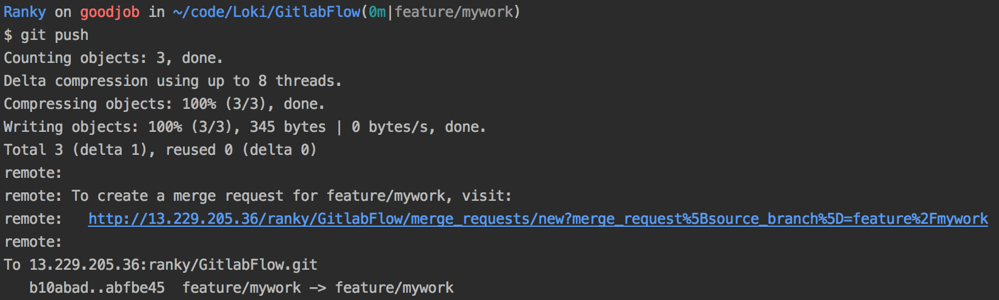

### 维护列表
* Ranky 2018-05-31

### 1.分支概要
* 发布版本release （为protect分支，该分支需要merge request）
* 主版本master（为 protect分支， 需要merge request）
* 自己的功能分支 feature/xxx

### 2.开发流程
* 所有开发人员单独开发分支，都在master上创建新的feature分支（这个分支尽量一个人开发，满足一个功能需求）
```
git checkout master
git branch feature/mywork
git checkout feature/mywork
```
将master分支上新的提交同步过来
git pull --rebase origin master

* 在自己的功能分支上修改代码，每一个小功能提交一次，最小单位为一天
```
git add .
git commit -m "[功能]1.更新目录;2.添加图片"
git push
```

* 功能开发完毕后，将master分支上新的提交同步过来
```
git pull --rebase origin master
```
* 如果发生冲突，解决冲突的文件，冲突文件中会有<<<等冲突标记，需要全部解决完，解决冲突文件后
```
git add .
git rebase --continue
```
* 如果没有冲突，或者解决完冲突，提交所有代码到功能分支，第一次push自己的分支到遠程請看下一段
```
git push
```
* 如果是第一次push自己的分支到遠程
```
git push --set-upstream origin feature/mywork
```
* 在terminal中提交后，会有如下图所示的提示。
  

* 此时，功能分支开发完毕，需要将提交merge request，请求将功能分支merge到master上，该操作需要在gitlab网页上进行。复制上图中的链接，在浏览器中打开该链接。
首先在网页的项目首页创建新到merge request。（如果是打开上图中的链接，可以直接跳到提交详情界面）

然后选择当前的feature分支，再选择需要merge到master上的分支，点击"Compare branches and continue"，创建merge request。

在提交详情页面，点击assign选项栏指定给项目负责人，点击submit提交merge request，就会看到如下图所示内容。


* 提交merge request后，如果急需将分支推送到主分支上，将merge request链接在IM工具上发送给代码审核人员。  
**审核人员要需要快速响应，仔细review每一行代码，功能是否完善，规范是否达标，指出需要怎么去改动。**  
对于不达标到request拒绝并让开发人修复完善，后重新提交merge request。
打回request方式，Edit，然后Delete。  
修复完成后，再次提交代码并push到自己到分支，然后再次提交merge request申请。

### 3.git tag标签
**所有release发布版本都需打tag标签**
* 显示所有标签
```
git tag
```
* 在以前的基础上升级一个版本号，打该版本的标签，如R2.3.1
```
git tag R2.3.1
```
* 提交tag
```
git push origin R2.3.1
```
* 如果做过tag标签后需要fix当前问题，需要删除之前的tag，然后重新打tag提交
```
git tag -d R2.3.1
git push origin :refs/tags/R2.3.1
git tag R2.3.1
git push origin R2.3.1
```

### 4.常用git命令
* git stash         缓存当前的改动，当不想提交自己本地修改的内容，而想切换到其他分支时
* git stash apply   拿取缓存改动，继续开发
* git reset HEAD^   回退当前的改动，将当前改动从缓存区退回到工作区
* git reset --hard HEAD^ 慎用，回退一个版本，且重置缓存区
* git cherry-pick commit-id   将一个commit-id合并到当前版本，适合从其他分支合并一个提交到当前分支
* git tag  查看当前的tag
* git tag XXX  创建名称为XXX的tag
* git push origin tagName 推送名字为tagName的标签
* git tag -d tagName  删除名字为tagName的标签
* git push origin :refs/tags/tagName  删除名字为tagName的远程标签

git branch -d    删除分支
git push origin --delete   删除远程分支
迁移git：git remote set-url origin git@52.220.212.168:payweb/newItpay-agency-front.git
git push -u origin --all
git push -u origin --tags
移除git缓存：
git rm -r --cached .
git add .
git commit -m 'update .gitignore'
git远程仓库回退版本
2.回退本地版本库 git reset commit_id
3.将回退后的版本强制推送到远程仓库。git push -f origin master